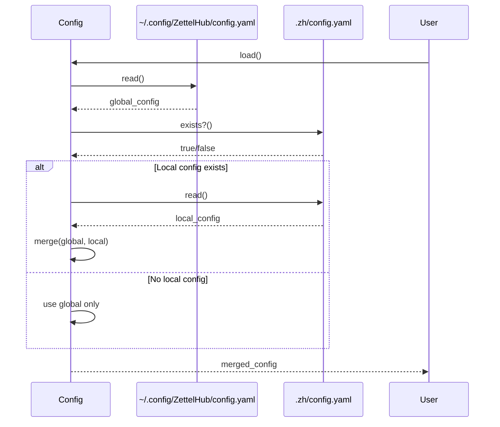
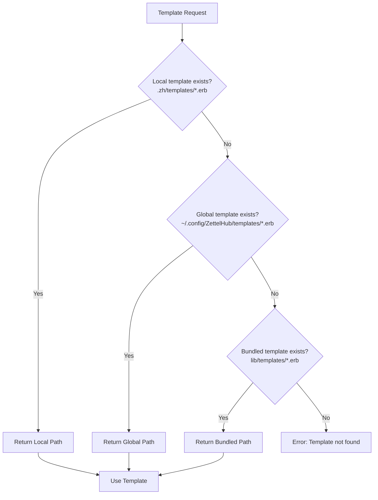

# ZettelHub Architecture

## System Overview

`ZettelHub` is a command-line tool for managing a Zettelkasten-style note-taking system. It provides a templating system for creating structured notes in GitHub-flavored Markdown with YAML front matter, and indexes these notes in a SQLite database for fast retrieval and search.

### Core Principles

- **Template-driven**: Notes are created from ERB templates with variable substitution
- **Type-based organization**: Different note types (notes, journals, meetings) can have different templates and file organization
- **Configuration hierarchy**: Global configuration with local notebook overrides
- **Indexed storage**: SQLite database for metadata indexing and full-text search (same notes table for all document types; no separate bookmarks table)
- **File-based storage**: Notes stored as Markdown files in the filesystem

## Architecture Diagram

```mermaid
graph TB
    User[User] --> CLI[bin/zh<br/>Bash Router]
    CLI --> AddCmd[lib/cmd/add.rb<br/>AddCommand]
    CLI --> InitCmd[lib/cmd/init.rb<br/>InitCommand]
    CLI --> SearchCmd[lib/cmd/search.rb<br/>SearchCommand]
    CLI --> FindCmd[lib/cmd/find.rb<br/>FindCommand]
    CLI --> JournalCmd[lib/cmd/journal.rb<br/>JournalCommand]
    CLI --> ReindexCmd[lib/cmd/reindex.rb<br/>ReindexCommand]
    CLI --> TagCmd[lib/cmd/tag.rb<br/>TagCommand]
    CLI --> ImportCmd[lib/cmd/import.rb<br/>ImportCommand]
    CLI --> LinksCmd[lib/cmd/links.rb<br/>LinksCommand]
    CLI --> BacklinksCmd[lib/cmd/backlinks.rb<br/>BacklinksCommand]
    CLI --> GraphCmd[lib/cmd/graph.rb<br/>GraphCommand]
    CLI --> BookmarkCmd[lib/cmd/bookmark.rb<br/>BookmarkCommand]
    CLI --> GitCmd[lib/cmd/git.rb<br/>GitCommand]
    CLI --> HistoryCmd[lib/cmd/history.rb<br/>HistoryCommand]
    CLI --> DiffCmd[lib/cmd/diff.rb<br/>DiffCommand]
    CLI --> RestoreCmd[lib/cmd/restore.rb<br/>RestoreCommand]
    CLI --> PersonCmd[lib/cmd/person.rb<br/>PersonCommand]
    CLI --> OrgCmd[lib/cmd/org.rb<br/>OrgCommand]
    
    AddCmd --> Config[lib/config.rb<br/>Config]
    AddCmd --> Utils[lib/utils.rb<br/>Utils]
    AddCmd --> Indexer[lib/indexer.rb<br/>Indexer]
    AddCmd --> NoteModel[lib/models/note.rb<br/>Note]
    
    SearchCmd --> Config
    SearchCmd --> Indexer
    SearchCmd --> SQLite[(.zh/index.db<br/>SQLite with FTS5)]
    
    FindCmd --> Config
    FindCmd --> FileSystem

    JournalCmd --> Config
    JournalCmd --> Utils
    JournalCmd --> AddCmd
    JournalCmd --> FileSystem
    
    ReindexCmd --> Config
    ReindexCmd --> Indexer
    ReindexCmd --> NoteModel
    
    TagCmd --> Config
    TagCmd --> Utils
    TagCmd --> Indexer
    TagCmd --> NoteModel
    TagCmd --> SQLite
    
    ImportCmd --> Config
    ImportCmd --> Indexer
    ImportCmd --> Utils
    ImportCmd --> NoteModel
    ImportCmd --> FileSystem
    
    LinksCmd --> Config
    LinksCmd --> Utils
    BacklinksCmd --> Config
    BacklinksCmd --> Utils
    GraphCmd --> Config
    GraphCmd --> Utils
    LinksCmd --> SQLite
    BacklinksCmd --> SQLite
    GraphCmd --> SQLite
    BookmarkCmd --> Config
    BookmarkCmd --> Utils
    BookmarkCmd --> SQLite
    BookmarkCmd --> NoteModel
    
    GitCmd --> Config
    GitCmd --> GitService[lib/git_service.rb<br/>GitService]
    HistoryCmd --> Config
    HistoryCmd --> GitService
    DiffCmd --> Config
    DiffCmd --> GitService
    RestoreCmd --> Config
    RestoreCmd --> GitService
    RestoreCmd --> Indexer
    
    GitService --> Git[(git binary)]
    
    AddCmd -.->|auto-commit| GitService
    TagCmd -.->|auto-commit| GitService
    ImportCmd -.->|auto-commit| GitService
    
    Config --> GlobalConfig[~/.config/ZettelHub/config.yaml]
    Config --> LocalConfig[.zh/config.yaml]
    
    Utils --> TemplateResolver[Template Resolution]
    TemplateResolver --> LocalTemplate[.zh/templates/*.erb]
    TemplateResolver --> GlobalTemplate[~/.config/ZettelHub/templates/*.erb]
    
    NoteModel --> Document[lib/models/document.rb<br/>Document]
    Document --> Journal[lib/models/journal.rb<br/>Journal]
    Document --> Meeting[lib/models/meeting.rb<br/>Meeting]
    Document --> Resource[lib/models/resource.rb<br/>Resource]
    Resource --> Bookmark[lib/models/bookmark.rb<br/>Bookmark]
    Document --> Person[lib/models/person.rb<br/>Person]
    Document --> Organization[lib/models/organization.rb<br/>Organization]
    Organization --> Account[lib/models/account.rb<br/>Account]
    
    PersonCmd --> Config
    PersonCmd --> Utils
    PersonCmd --> SQLite
    PersonCmd --> Person
    PersonCmd --> VcfParser[lib/vcf_parser.rb<br/>VcfParser]
    OrgCmd --> Config
    OrgCmd --> Utils
    OrgCmd --> SQLite
    OrgCmd --> Organization
    
    Indexer --> SQLite
    
    AddCmd --> FileSystem[(Notebook Directory<br/>Markdown Files)]
    SearchCmd --> FileSystem
    ReindexCmd --> FileSystem
    TagCmd --> FileSystem
```



## Component Architecture

### 1. CLI Layer (`bin/zh`)

**Purpose**: Entry point and command router

**Responsibilities**:
- Parse command-line arguments
- Route to appropriate command implementation
- Handle command not found errors

**Implementation**: Bash script that delegates to Ruby command classes

**Key Features**:
- Simple case statement for command routing
- Passes remaining arguments to command implementations
- Provides usage information for unknown commands
- Shell completion support with dynamic command discovery

#### Shell Completion

The CLI provides bash completion support that automatically discovers commands from the `lib/cmd/` directory. This ensures that new commands automatically appear in shell completion without manual updates.

**Usage**:
- Generate completion script: `zh _completion` or `zh completion`
- Source for current session: `source <(zh _completion)`
- Install permanently: Add `source <(zh _completion)` to `~/.bashrc` or `~/.zshrc`
- To support aliases (e.g. `zk`), run `source <(zh completion zh zk)` to register completion for both names; see [bin/zh](bin/zh) completion branch.

**How it works**:
- The completion script dynamically scans `lib/cmd/` for `.rb` files
- Command names are extracted from filenames (e.g., `add.rb` → `add`)
- Completion candidates are generated using bash's `compgen` builtin
- The completion function is registered with bash's `complete` builtin
- **Command-driven completion**: Each command implements its own completion logic via `--completion` option
- The bash completion script dynamically calls commands with `--completion` to get completion candidates

**Completion Features**:

1. **Command Name Completion**: Automatically discovers all commands from `lib/cmd/` directory
2. **Option Completion**: Provides completion for common options (`--help`, `--version`) when typing options (starting with `--`)
3. **Command-Specific Arguments**: Each command provides its own completions via `--completion` option
   - `add` command: Returns template types from configuration
   - `init` command: Returns empty (no arguments)
   - `find` command: Returns empty (optional initial query)
   - `tag` command: Returns subcommands (list, add, remove, rename) and tag names for add/remove/rename
4. **Fully Dynamic**: New commands automatically provide completion without modifying the bash script

**Implementation Details**:
- **Command Completion Interface**: Commands check for `--completion` as first argument and output space-separated candidates
- Every command must implement both `--completion` and command-specific `--help`/`-h`; see [Adding New Commands](#adding-new-commands) and [AGENTS.md](AGENTS.md#help-system-requirements).
- **Bash Script**: Dynamically calls `ruby lib/cmd/{command}.rb --completion` to get completions
- **Helper Script**: `lib/cmd/_completion_helper.rb` provides shared completion data (common options)
- **Graceful Degradation**: Commands that don't implement `--completion` return empty completions
- **Error Handling**: Completion failures are handled gracefully (empty completions)

**Command Completion Pattern**:
Each command in `lib/cmd/` should implement the `--completion` option:

```ruby
def run(*args)
  return output_completion if args.first == '--completion'
  # Normal command execution
end

private

def output_completion
  # Return space-separated completion candidates
  puts candidates.join(' ')
end
```

**Extending Completion for New Commands**:
New commands automatically get completion support. To provide command-specific completions:
1. Implement `--completion` option handling in the command's `run` method
2. Add a private `output_completion` method that returns space-separated candidates
3. No changes needed to the bash completion script - it automatically discovers and calls the command

### 2. Command Layer (`lib/cmd/`)

**Purpose**: Business logic for each CLI command

**Pattern**: Each command is an executable Ruby script with a class implementing the command logic. Each command must handle `--help`/`-h` and `--completion` and provide `output_help` and completion candidates.

#### AddCommand (`lib/cmd/add.rb`)

**Responsibilities**:
- Load configuration
- Resolve template configuration
- Find and render template file
- Parse template front matter for `config.path` override
- Create note file with proper naming and directory structure (using config.path if present)
- Remove `config` attribute from output file
- Reconstruct content using CommonMarker document objects
- Index the created note
- Provide completion candidates via `--completion` option (template types from configuration)

**Flow**:
1. Load merged config (global + local)
2. Get template configuration for note type
3. Find template file (local-first, fallback to global)
4. Render template with ERB variables
5. Parse front matter to check for `config.path` override
6. If `config.path` exists:
   - Use it as filepath (with variable interpolation)
   - Remove `config` attribute from metadata
   - Reconstruct content using CommonMarker
7. Derive path from template's `config.path` (with variable interpolation; fallback `{type}-{date}.md` if missing)
8. Index note in SQLite database

**Template path**:
The output path is taken only from the template's `config.path` in front matter (variable interpolation is applied). If `config.path` is missing, a default pattern `{type}-{date}.md` is used. Templates can also define `config.default_tags` (YAML array); these are
merged with user-supplied tags (defaults first, then supplied, then uniq) before the note is
written. The entire `config` attribute is automatically removed from the final output file.
The path supports variable interpolation using metadata fields and time variables.

**Important**: The `config.path` value **must be quoted** in the template to prevent
YAML parsing errors when the interpolated values contain special characters (e.g., `:`, `#`):
```yaml
config:
    path: "<%= id %>-<%= title %>.md"  # ✓ Correct: quoted
    path: <%= id %>-<%= title %>.md     # ✗ Wrong: unquoted (will fail with special chars)
```

**ERB Rendering Isolation**:
Template rendering is performed in an isolated method (`render_erb_with_context`) to avoid Ruby variable shadowing. Method parameters like `title: nil` would otherwise shadow `context.title` in the ERB binding, causing template variables to render as empty. See [AGENTS.md](AGENTS.md#erb-variable-shadowing-in-template-rendering) for details.

**Filename Normalization with `slugify`**:
Templates have access to a `slugify` function that can be used to normalize strings for
filenames. The `slugify` function converts text to lowercase, replaces spaces and special
characters with a configurable replacement character (default: `-` hyphen), and cleans up
the result. This is useful for creating filesystem-friendly and URL-safe filenames:

```yaml
config:
    path: "<%= slugify(id) %>-<%= slugify(title) %>.md"
```

The `slugify` function is available in all ERB templates and can be called on any variable
or string value. The replacement character can be configured in `config.yaml` via the
`engine.slugify_replacement` option (default: `'-'`). It preserves hyphens and existing underscores,
making it suitable for normalizing user-provided titles or other metadata that may contain
special characters.

**Date Format Configuration**:
The date format used in templates is configurable via the `engine.date_format` option in `config.yaml`.
This uses Ruby's standard `strftime` format strings (default: `'%Y-%m-%d'` for ISO 8601).
The configured format affects the `date` variable available in ERB templates.

**Alias Pattern Configuration**:
Aliases are automatically generated for each note using a configurable pattern. The pattern
supports variable interpolation (similar to filename patterns) and defaults to
`'{type}> {date}: {title}'` (e.g., "note> 2024-01-15: Meeting Notes"). This format is
designed to aid searching with tools like `fzf` or `grep`. The pattern can be customized
via the `engine.default_alias` option in `config.yaml` and supports variables: `{type}`, `{date}`,
`{title}`, `{year}`, `{month}`, and `{id}`.

#### InitCommand (`lib/cmd/init.rb`)

**Responsibilities**:
- Initialize new notebook directory
- Create `.zh` directory structure
- Create default local configuration file
- Provide completion candidates via `--completion` option (returns empty, no arguments)

#### SearchCommand (`lib/cmd/search.rb`)

**Responsibilities**:
- Perform full-text search across indexed notes using FTS5
- Filter results by type, tag, date range, and path pattern
- Format results in multiple output formats (list, table, JSON)
- Provide interactive search mode using `fzf` with glow preview
- Use BM25 relevance ranking for result ordering

**Flow**:
1. Parse command-line arguments (query string and filter options)
2. Load configuration to locate database
3. Build SQL query with FTS5 search and metadata filters
4. Execute query against SQLite database
5. Format and display results based on output format
6. By default (interactive): launch fzf with preview; if a format is requested (--list, --table, --json, or --format): print to stdout.

**Search Query Building**:
- Uses FTS5 virtual table (`notes_fts`) for full-text search
- Joins with `notes` table to access metadata for filtering
- Supports FTS5 query syntax: AND (space-separated), OR, phrase matching (`"phrase"`), exclusion (`-word`)
- Uses `bm25(notes_fts)` function for relevance ranking
- Orders results by relevance (lower BM25 score = higher relevance)

**Filtering**:
- **Type filter** (`--type`): Filters by note type using `json_extract(metadata, '$.type')`
- **Tag filter** (`--tag`): Checks if tags array contains specified tag using JSON functions
- **Date filter** (`--date`): Supports multiple formats:
  - Single date: `"2026-01-15"` (exact match)
  - Month: `"2026-01"` (matches entire month)
  - Range: `"2026-01-15:2026-01-20"` (BETWEEN query)
- **Path filter** (`--path`): Uses SQL LIKE pattern matching on relative path

**Output Formats**:
- **List** / **Table** / **JSON**: used when not interactive (e.g. --list, --table, --json, or --format).
- **Interactive** (default): fzf with preview.

**Interactive Mode**:
- **Default behavior**: fzf with preview. Use **--list**, **--table**, or **--json** (or **--format**) to print results to stdout instead of opening fzf.
- Uses bat for previews (falls back to `cat` if unavailable). Tool theming is configured via each tool's own config.
- Formats input as pipe-delimited fields: rank, id, type, date, title, tags, full_path (7 fields).
- Returns the value specified by `--accept-nth` (default: last field, i.e. full path)
- Gracefully falls back to list format if filter tool (default fzf) is not available
- **Key bindings** (when configured): **Enter** = accept and output selected path; **Ctrl-O** = open in Editor; **Ctrl-B** = Open (system default). Editor uses `$EDITOR` when set.
- **Configurable via config** (single templates; placeholders `{path}` and `{line}` substituted by context):
  - `editor_command` (Editor; default `$EDITOR {path} +{line}`; search uses `{-1}`, find uses `{1}` and `{2}`)
  - `preview_command` (Preview; default bat with options or cat)
  - `open_command` (Open/system; optional; default open or xdg-open)
  - `reader_command` (Reader for full-note reading; optional; default glow or less)
  - `filter_command` (Filter UI binary; optional; default `fzf`)
  - `tools.filter.search.display_format` (--with-nth; default `{1}>{3}>{4},{5} (id:{2}) [tags:{6}]` for 7 fields)
  - `tools.filter.search.select_expression` (--accept-nth; default `-1`)
  - `filter_preview_window` (default `up:60%`; e.g. `right:70%`, `down:50%`)
  - `filter_header` (optional one-line hint, e.g. key bindings; search default `Search: Enter=edit | Ctrl-R=read | Ctrl-O=open`)

**Error Handling**:
- Validates database exists before searching
- Handles invalid FTS5 query syntax with helpful error messages
- Handles missing filter/bat tools gracefully (fallback to list format)
- Validates date format inputs
- Provides clear messages for empty search results

#### FindCommand (`lib/cmd/find.rb`)

**Responsibilities**:
- Interactive find in note content using ripgrep and fzf (always interactive)
- Search markdown files under the notebook path with ripgrep; fzf UI with reload-on-query as you type
- Open selected file at line in user's editor on Enter

**Flow**:
1. Parse optional initial query (first non-option argument)
2. Load configuration and resolve notebook path
3. Require `rg` and `fzf`; exit with clear error if missing
4. Build ripgrep prefix (notebook path, `*.md` glob, exclude `.zh`)
5. Launch fzf with `--disabled`, `start:reload(rg ... {q})`, `change:reload(sleep 0.1; rg ... {q} || true)`
6. Bind Enter, Ctrl-R, Ctrl-O from config keybindings (placeholders substituted)
7. Use configured Preview (bat with line highlight or cat fallback) and preview window

**Config (optional in config.yaml)**:
- `editor_command`, `preview_command`, `open_command`, `filter_command` (same as search; find context uses `{1}` = path, `{2}` = line)
- `filter_find_header`: Header line (fallback to `filter_header`)

**Key bindings (from config)**:
- **Enter**: Open selected file at line in Editor
- **Ctrl-R**: Read selected file (reader)
- **Ctrl-O**: Open selected file (system)

**Error Handling**:
- Exits with error if notebook path not found
- Exits with clear message if `rg` or `fzf` not installed

#### JournalCommand (`lib/cmd/journal.rb`)

**Responsibilities**:
- Open or create a daily journal entry for a given date, then open it in the configured editor
- Three entry points: `zh today`, `zh yesterday`, and `zh journal <DATE>`
- Resolve date from argument (`today`, `yesterday`, `tomorrow`, or a parseable date string)
- Compute journal file path from config `journal.path_pattern` (default `journal/{date}.md`) and `engine.date_format`
- If the file does not exist, create it using the journal template (with date-specific vars) via `AddCommand#create_note_file`, then open in editor
- If the file exists, open it in the editor without creating

**Flow**:
1. Handle `--completion` (returns `today yesterday`) or `--help`
2. Parse first argument to resolve a `Date` (today, yesterday, tomorrow, or `Date.parse(spec)`)
3. Load config; require editor tool
4. Compute path: `notebook_path` + `interpolate(journal.path_pattern, { date: resolved_date })`
5. If file missing: get journal template, render with `Utils.time_vars_for_date`, call `AddCommand#create_note_file`, then open returned path in editor
6. Build editor command from `tools.editor.journal` (args default `{path}`), substitute path, run with `system()`

**Config**:
- `journal.path_pattern`: Path pattern for journal files (default `journal/{date}.md`)
- `tools.editor.journal.args`: Editor arguments (default `{path}`)
- Uses existing `engine.date_format` for the `{date}` value

#### TagCommand (`lib/cmd/tag.rb`)

**Responsibilities**:
- List all tags with note counts (`zh tags` or `zh tag list`)
- Add or remove a tag on a single note by note ID (`zh tag add TAG NOTE_ID`, `zh tag remove TAG NOTE_ID`)
- Rename a tag across all notes (`zh tag rename OLD_TAG NEW_TAG`)

**Flow**:
- Resolves note path by ID via `Utils.note_path_by_id(config, id)` (reads from index)
- Updates note front matter (tags array) and rewrites file using `Utils.reconstruct_note_content`, then reindexes the note
- Tag list and rename query the index (JSON metadata `$.tags`) for tag names and counts

**CLI**: `zh tag` (subcommands: list, add, remove, rename) and `zh tags` (alias for list). Implements `--help` and `--completion` (subcommands and tag names).

#### ImportCommand (`lib/cmd/import.rb`)

**Responsibilities**:
- Bulk import markdown notes from paths or directories into the notebook
- Inspect existing metadata (front matter), assign a new ID to each note, and update front matter
- Resolve links: both wikilink syntax (`[[id]]` / `[[title]]`) and Markdown link syntax (`[text](path)`) when the target is in the same import batch; replace with new IDs or new relative paths
- Write imported notes under a target directory relative to `notebook_path` (CLI `--into` / `--target-dir` or config `import.default_target_dir`)
- Index each imported note via the Indexer
- Optional `--dry-run`: report what would be imported, what would change (ID and link rewrites), and what would fail; no files written, no index updates

**Flow**:
1. Parse args: `--dry-run`, `--into` / `--target-dir`, `--recursive`, and path list
2. Resolve target dir from flag or `Config.get_import_default_target_dir`
3. **Pass 1**: Collect source paths (expand globs, optionally recurse); for each file, parse front matter, assign `new_id`, build maps: `old_id -> new_id`, `title -> new_id`, `source_absolute_path -> new_relative_path`
4. **Pass 2**: For each note, set `metadata['id'] = new_id`, strip `config` from metadata; resolve wikilinks and Markdown links in body; reconstruct content; if not dry run: write to `notebook_path/target_dir/{new_id}-{slug}.md`, then index via `Note.new(path)` and `Indexer#index_note`; if dry run: record changes for report
5. Output: per-file "Imported: path" or dry-run report (Would import / Would fail)

**Link resolution**:
- **Wikilinks**: Replace `[[x]]` with `[[new_id]]` when `x` matches an old ID or title in the batch
- **Markdown links**: Replace `[text](url)` when `url` is a relative path that resolves to a file in the batch; substitute with the new relative path (from notebook root)

#### BookmarkCommand (`lib/cmd/bookmark.rb`)

**Responsibilities**:
- **No subcommand (interactive browser)**: List bookmarks from the notes table (`type = bookmark`), present in fzf; on Enter, look up `uri` via `Utils.get_metadata_attribute(db_path, id, 'uri')` and open with `open` (macOS) or `xdg-open` (Linux). Does not extend SearchCommand.
- **add**: Create a bookmark from a URL: validate URI, render bookmark template with `uri`, write file, optionally fetch `<meta name="description">` with Nokogiri, index via `Note.new(path)` and `Indexer#index_note`.
- **export**: Query notes where `json_extract(metadata, '$.type') = 'bookmark'`, write Netscape `bookmarks.html`.

**Storage**: Bookmarks use the same notes table and indexer; no separate bookmarks table. Template type is `bookmark`; model is Bookmark (extends Resource).

#### PersonCommand (`lib/cmd/person.rb`)

**Responsibilities**:
- **No subcommand (browse)**: Interactive contact browser using fzf with preview
- **add**: Create new contact using person template with dynamic prompts
- **list**: List all contacts in table or JSON format
- **import FILE**: Import contacts from vCard (.vcf) file using VcfParser
- **export**: Export contacts to vCard format
- **birthdays**: Show upcoming birthdays within configurable days
- **stale**: Show contacts not contacted recently (configurable threshold)
- **merge ID1 ID2**: Merge duplicate contacts (keeps first, updates links)

**VCF Interoperability**: Uses `lib/vcf_parser.rb` for import/export with standard vCard format.

#### OrgCommand (`lib/cmd/org.rb`)

**Responsibilities**:
- **No subcommand (browse)**: Interactive organization browser using fzf
- **add**: Create new organization using organization template
- **add --type account**: Create new customer account using account template
- **list**: List all organizations/accounts in table or JSON format
- **tree NOTE_ID**: Display organization hierarchy as ASCII tree
- **parent NOTE_ID**: Show parent organization
- **subs NOTE_ID**: List direct subsidiaries
- **ancestors NOTE_ID**: List all ancestor organizations
- **descendants NOTE_ID**: List all descendant organizations

**Hierarchy Support**: Uses `parent` and `subsidiaries` metadata fields containing wikilinks. Hierarchy traversal uses `Utils.ancestor_ids` and `Utils.descendant_ids`.

### 3. Model Layer (`lib/models/`)

**Purpose**: Represent note documents and their metadata

#### Document (`lib/models/document.rb`)

**Base class** for all document types.

**Attributes**:
- `id`: Unique identifier (auto-generated if not provided)
- `title`: Document title
- `type`: Document type (note, journal, meeting, etc.)
- `path`: File system path to document
- `date`: Document date
- `content`: Document body content
- `metadata`: YAML front matter as hash
- `body`: Document body (content without front matter)

**Key Methods**:
- `generate_id`: Creates 8-character hex ID using SecureRandom

#### Note (`lib/models/note.rb`)

**Base note class** that extends Document.

**Responsibilities**:
- Parse Markdown file with YAML front matter
- Extract metadata from front matter
- Initialize Document with file contents

**Initialization**:
- Requires `path` parameter
- Reads file and parses front matter using `Utils.parse_front_matter`
- Merges provided metadata with file metadata
- Generates ID if not present in metadata

#### Specialized Types

- **Journal** (`lib/models/journal.rb`): Extends Note (currently empty, extension point)
- **Meeting** (`lib/models/meeting.rb`): Extends Note (currently empty, extension point)
- **Resource** (`lib/models/resource.rb`): Extends Document; file-based base for resource-type documents (sibling of Note).
- **Bookmark** (`lib/models/bookmark.rb`): Extends Resource; has `uri` from metadata. Bookmarks are notes with `type: bookmark` in the same notes table and FTS index.
- **Person** (`lib/models/person.rb`): Extends Document; contact/people management with accessors for `full_name`, `emails`, `phones`, `organization`, `role`, `birthday`, `social`, `relationships`, `last_contact`. Supports `@Name` alias format for concise wikilinks.
- **Organization** (`lib/models/organization.rb`): Extends Document; organization management with hierarchy support via `parent` and `subsidiaries` wikilink fields. Includes `parent_id` and `subsidiary_ids` methods for ID extraction.
- **Account** (`lib/models/account.rb`): Extends Organization; customer accounts. Custom fields (CRM data, revenue, etc.) are accessed via the generic `metadata` hash, keeping the model domain-agnostic.

### 4. Service Layer

#### Config (`lib/config.rb`)

**Purpose**: Configuration management with global/local merge strategy

**Responsibilities**:
- Load global configuration from `~/.config/ZettelHub/config.yaml`
- Load local configuration from `.zh/config.yaml` (if exists)
- Merge configurations (local overrides global)
- Discover templates by enumerating `.erb` files (bundled, global, local dirs)
- Infer template type from each template's front matter; resolve template file by type

**Configuration Structure**:
```yaml
notebook_path: ~/Documents/notes
engine:
  date_format: '%Y-%m-%d'
  # ...
```

**Template discovery**:
- Templates are not listed in config. `Config.discover_templates(notebook_path)` enumerates `.erb` files from bundled (`lib/templates/`), global (`~/.config/ZettelHub/templates/`), and local (`.zh/templates/`) directories; local overrides global overrides bundled by basename.
- Type is inferred from the `type` key in each template's YAML front matter (or filename stem if type contains ERB).
- `get_template(config, name)` and `template_types(config)` use discovery only. Returned template has `type` and `template_file` (no `filename_pattern` or `subdirectory`).

#### Indexer (`lib/indexer.rb`)

**Purpose**: Index note metadata in SQLite database and maintain link tracking and backlinks

**Responsibilities**:
- Create SQLite database if it doesn't exist
- Create notes table and **links** table schema
- Index note metadata (INSERT OR REPLACE)
- **Link tracking**: On each index, delete outgoing links for the note, extract wikilinks and markdown links from body (using shared helpers in `lib/utils.rb`), resolve targets to note ids, insert rows into `links`
- **Rename handling**: When a note's path changes (same id), rewrite markdown link targets in all notes that link to it (backlink sources) via `Utils.rewrite_markdown_links_for_rename`
- **Backlinks section**: Update the `## Backlinks` section at the end of note files (CommonMarker AST: remove existing section, append new list from `links WHERE target_id = ?`). Only written when the note has backlinks or had an existing section to remove; omitted when zero backlinks to avoid touching files unnecessarily.

**Database Schema**:
```sql
CREATE TABLE notes (
  id TEXT PRIMARY KEY,
  path TEXT,
  metadata TEXT,  -- JSON-encoded metadata
  title TEXT,
  body TEXT,
  filename TEXT
);

CREATE TABLE links (
  source_id TEXT NOT NULL,
  target_id TEXT NOT NULL,
  link_type TEXT,   -- 'wikilink' or 'markdown'
  context TEXT
);

CREATE TABLE tags (
  note_id TEXT NOT NULL,
  tag TEXT NOT NULL,
  source TEXT NOT NULL DEFAULT 'frontmatter',
  PRIMARY KEY (note_id, tag, source)
);
-- Indexes on source_id and target_id for outgoing and backlink queries.
-- Indexes on tags.tag, tags.note_id, tags.source for efficient lookups.
```

**Unified Tag Storage**:
All tags are stored in a single `tags` table with a `source` column indicating origin:
- `frontmatter`: Tags from YAML front matter (`tags: [...]`)
- `body`: Hashtags extracted from note body (`#tagname`)

Body hashtag extraction is configurable via `tags.extract_body_hashtags` (default: true), with exclusion patterns and length limits. The `zh tags` command queries this unified table and shows tag sources.

**Storage Strategy**:
- Stores relative paths from notebook root
- Stores metadata as JSON string
- Uses INSERT OR REPLACE for idempotent updates
- Link extraction and resolution use shared helpers in `lib/utils.rb` (e.g. `Utils.extract_wikilinks`, `Utils.resolve_wikilink_to_id`, `Utils.resolve_markdown_path_to_id`) so import and indexer stay consistent.

#### GitService (`lib/git_service.rb`)

**Purpose**: Git version control wrapper for notebook repositories

**Responsibilities**:
- Check if notebook is a git repository
- Initialize repository with `.gitignore` for `.zh/`
- Track file status (modified, added, deleted, untracked, staged)
- Commit changes with messages
- Push to and pull from remote repositories
- Get commit history (log) for files
- Show file content at specific commits
- Generate diff output
- Restore files from previous commits

**Key Methods**:
- `repo?` - Check if directory is a git repo
- `init(remote:)` - Initialize repo, create `.gitignore`
- `status` - Return hash of file status arrays
- `commit(message:, paths:, all:)` - Stage and commit changes
- `push(remote:, branch:)` / `pull(remote:, branch:)` - Remote sync
- `log(path:, limit:)` - Get commit history
- `diff(path:, commit:, staged:)` - Get diff output
- `show(commit:, path:)` - Get file at commit
- `checkout(path:, commit:)` - Restore file from commit

**Auto-commit Integration**:
Commands (`AddCommand`, `TagCommand`, `ImportCommand`) check `Config.get_git_auto_commit(config)` after operations and call `GitService.commit` if enabled. If `auto_push` is also enabled, they push to the configured remote/branch.

#### Template Variables (`lib/template_vars.rb`)

**Purpose**: Resolve custom variables defined in template front matter

**Responsibilities**:
- Extract custom keys from YAML front matter (keys not in the standard set)
- Detect variable dependencies via ERB tag scanning
- Build dependency graph and perform topological sort
- Resolve variables in dependency order using ERB rendering
- Handle cyclic dependency detection with clear error messages

**Key Methods**:
- `extract_custom_keys(frontmatter)` - Find non-standard YAML keys
- `detect_dependencies(value)` - Scan for `<%= var %>` references
- `topological_sort(graph)` - Order variables by dependencies
- `resolve_custom_vars(custom_keys, base_vars, slugify_proc:)` - Evaluate all custom variables

#### Dynamic Prompts (`lib/prompt_*.rb`, `lib/option_source.rb`, etc.)

**Purpose**: Interactive data collection defined in templates

**Modules**:
- **PromptCollector** (`lib/prompt_collector.rb`): Orchestrates prompt execution, condition evaluation, validation retry loops
- **PromptExecutor** (`lib/prompt_executor.rb`): Executes individual prompts (input, write, choose, filter, confirm) using `gum` or stdin fallback
- **ConditionEvaluator** (`lib/condition_evaluator.rb`): Evaluates `when` conditions for conditional prompts (`==`, `!=`, `=~`, `in`, `&&`, `||`, `?`)
- **ValueTransformer** (`lib/value_transformer.rb`): Applies transformations to collected values (trim, lowercase, slugify, split, join, etc.)
- **ValueValidator** (`lib/value_validator.rb`): Validates input against rules (required, type, pattern, min/max length)
- **OptionSource** (`lib/option_source.rb`): Resolves dynamic options from sources (tags, notes, files, command)

**Template Prompt Definition**:
```yaml
config:
  prompts:
    - key: title
      type: input
      prompt: "Meeting title"
      required: true
    - key: category
      type: choose
      prompt: "Select category"
      source:
        type: tags
      required: true
    - key: account
      type: filter
      prompt: "Related account"
      optional: true           # Shows "Add Related account? [y/n]" first
      source:
        type: notes
        filter_type: account
        return: wikilink
    - key: attendees
      type: filter
      prompt: "Select attendees"
      optional: true
      multi: true              # Allows selecting multiple items
      source:
        type: notes
        filter_type: person
        return: wikilink
```

**Prompt Flags**:
- **`required: true`**: Field must have a value; re-prompts if empty
- **`optional: true`**: Shows yes/no confirmation before prompting; if declined, uses default or nil
- **`multi: true`**: For `choose` and `filter` types, allows selecting multiple items; returns array

#### Theme (`lib/theme.rb`)

**Purpose**: Unified color theming for CLI tools

**Responsibilities**:
- Load theme palettes (bundled and user-defined)
- Generate tool-specific configurations (gum env vars, fzf colors, glow styles)
- Export theme as shell environment variables
- Preview themes in terminal with color swatches

**Key Methods**:
- `load(theme_name, debug:)` - Load theme by name (searches user then bundled)
- `list` - List all available theme names
- `gum_env(palette)` - Generate gum environment variables hash
- `fzf_colors(palette)` - Generate fzf `--color` option string
- `glow_style(palette, theme_name)` - Generate glow glamour style JSON
- `ripgrep_colors(palette)` - Generate ripgrep color configuration
- `export_shell(theme_data, format:)` - Export as shell script (:bash, :zsh, :fish)
- `apply(theme_data, output_dir:)` - Write config files (glow style JSON)
- `preview(theme_data)` - Preview colors in terminal

**Built-in Themes** (`lib/themes/`):
- `nord.yaml` - Arctic, north-bluish palette
- `dracula.yaml` - Dark theme with vibrant colors
- `tokyo-night.yaml` - Clean dark theme
- `gruvbox.yaml` - Retro groove, warm tones
- `catppuccin.yaml` - Soothing pastel (Mocha)

**Palette Keys**:
- `bg`, `bg_highlight`, `bg_selection` - Background colors
- `fg`, `fg_muted` - Foreground colors
- `accent`, `accent_secondary` - Accent colors
- `success`, `warning`, `error`, `info` - Semantic colors
- `match`, `comment` - Highlight colors

#### ThemeCommand (`lib/cmd/theme.rb`)

**Responsibilities**:
- **list**: List available themes with descriptions
- **current**: Show current theme from config
- **preview NAME**: Preview theme colors in terminal
- **export NAME**: Output shell environment variables
- **apply NAME**: Write config files (glow style, etc.)

**Shell Integration**:
- Bash/Zsh: `eval "$(zh theme export)"`
- Fish: `zh theme export --fish | source`

#### VCF Parser (`lib/vcf_parser.rb`)

**Purpose**: vCard import/export for contact interoperability

**Responsibilities**:
- Parse vCard 3.0/4.0 files to Ruby hashes
- Handle property parameters, escaped characters, folded lines
- Normalize contact data structure
- Export Person notes to vCard format

**Key Methods**:
- `parse_file(filepath)` - Parse VCF file, return array of contact hashes
- `parse(content)` - Parse VCF string content
- `to_vcard(contact, version:)` - Convert contact hash to VCF string

### 5. Utility Layer (`lib/utils.rb`)

**Purpose**: Shared utility functions

**Key Functions**:

- **`parse_front_matter(content)`**: Parses YAML front matter from Markdown using CommonMarker
  - Returns `[metadata_hash, body_content]`
  - Handles front matter delimiters (`---`)

**Markdown Construction**:
- Always use CommonMarker to construct markdown documents programmatically
- Parse content with CommonMarker to validate and format
- Use CommonMarker's document objects rather than string concatenation
- This ensures proper formatting and consistency with CommonMark standards
  
- **`current_time_vars(date_format: nil)`**: Returns hash of time-based template variables
  - `date`: Formatted using configured date format (default: `'%Y-%m-%d'` ISO 8601)
  - `year`, `month`, `day`: 4-digit year, 2-digit month, 2-digit day of month
  - `week`, `week_year`: ISO week number and ISO week year (for weekly journals)
  - `month_name`, `month_name_short`: Full and abbreviated month names (e.g. February, Feb)
  - `day_name`, `day_name_short`: Full and abbreviated weekday names (e.g. Monday, Mon)
  - `time`, `time_iso`: Time as `HH:MM` and `HH:MM:SS`
  - `hour`, `minute`, `second`: Time components
  - `timestamp`: `%Y%m%d%H%M%S` for unique filenames
  - `id`: 8-character hexadecimal ID (generated using SecureRandom via `Utils.generate_id`)
  - Date format can be configured via `engine.date_format` in config.yaml
  - Add command also injects: `type`, `title`, `tags`, `aliases`, `content`, `description` (description is excluded from path interpolation)

- **Alias Generation**: Aliases are automatically generated in `AddCommand.render_template` using
  the configured `default_alias` (default: `'{type}> {date}: {title}'`). The pattern supports
  variable interpolation with all available template variables. Aliases are useful for searching
  with tools like `fzf` or `grep`.

- **`interpolate_pattern(pattern, variables)`**: Replaces `{key}` placeholders in patterns
  - Used for template `config.path` and journal path patterns
  - Supports metadata fields as variables

- **`slugify(text, replacement_char: '-')`**: Normalizes strings for use in filenames
  - Converts to lowercase
  - Replaces spaces and special characters with replacement character (default: `-` hyphen)
  - Collapses multiple consecutive replacement characters
  - Removes leading/trailing replacement characters
  - Preserves hyphens and existing underscores
  - Available in ERB templates via the binding context
  - Replacement character is configurable via `engine.slugify_replacement` in config.yaml

- **`build_tool_invocation(executable, opts, args)`**: Builds command-line invocation string for editor, preview, open, reader; used by search and find for keybindings and preview.

- **`find_template_file(notebook_path, template_filename)`** / **`find_template_file!`**: Template resolution
  - Checks local: `.zh/templates/{filename}`
  - Falls back to global: `~/.config/ZettelHub/templates/{filename}`
  - Falls back to bundled: `lib/templates/{filename}`
  - Returns first found path or nil

- **`generate_id`**: Generates 8-character hex ID using SecureRandom. This is the shared ID generation method used by both `Document.generate_id` and `Utils.current_time_vars` to ensure consistent ID generation across all note creation paths.

- **`note_path_by_id(config, id)`**: Returns the absolute path of the note file for the given note ID by querying the index, or nil if not found. Used by TagCommand (and future update/delete commands).
- **`get_metadata_attribute(db_path, document_id, attribute_key)`**: Returns a single metadata attribute for a document by id (e.g. `uri` for bookmarks), or nil. Used by BookmarkCommand to resolve a bookmark’s URI after the user selects by id in the interactive browser.

- **Link helpers** (shared by indexer, import, and links/backlinks/graph commands): `WIKILINK_PATTERN`, `MARKDOWN_LINK_PATTERN`; `extract_wikilinks(body)`, `extract_markdown_link_urls(body)`; `resolve_wikilink_to_id(link_text, db)` (by id, title, or alias; handles `id|display_text` format by parsing out the target before `|`); `resolve_markdown_path_to_id(url, current_note_path, notebook_path, db)`; `rewrite_markdown_links_for_rename(body, source_note_path, notebook_path, old_rel_path, new_rel_path)` for reindex rename; `resolve_link_target_to_new_path` and `resolve_markdown_links_with_mapping` for import path mapping.

- **`reconstruct_note_content(metadata, body)`**: Rebuilds Markdown with YAML front matter and validated body via CommonMarker. Used when updating note front matter (e.g. tags) without changing the template. Used by AddCommand and TagCommand.

- **Hierarchy helpers** (for organization parent/subsidiary relationships):
  - `extract_id_from_wikilink(wikilink)`: Extracts ID from `[[id|title]]` or `[[id]]` format
  - `extract_title_from_wikilink(wikilink)`: Extracts title (or ID if no title) from wikilink
  - `parent_org_id(note)`: Returns parent organization ID from note's `parent` field
  - `subsidiary_ids(note)`: Returns array of subsidiary IDs from note's `subsidiaries` field
  - `ancestor_ids(note, db)`: Traverses up the hierarchy to find all ancestor IDs
  - `descendant_ids(note, db)`: Traverses down the hierarchy to find all descendant IDs
  - `load_note_by_id(db, note_id)`: Loads note metadata from database into OpenStruct

### Debugging output

All modules and methods must provide debugging output so that behavior can be inspected when `ZH_DEBUG=1` is set.

- **Commands** (`lib/cmd/`): Include the `Debug` module; use `debug?` and `debug_print(message)` to log key steps, inputs, and outcomes (e.g. config resolution, file counts, indexing/removal summaries). Pass `debug: debug?` into Config and other callables that accept a debug option.
- **Indexer, Config, Utils**: Include `Debug` where applicable and emit debug lines for significant operations (e.g. index insert/update/remove, config resolution, template resolution).
- **New code**: When adding or changing any module or method, add or extend `debug_print` calls so that the new behavior is visible under `ZH_DEBUG=1`. Debug is enabled only via the `ZH_DEBUG=1` environment variable (no `--debug` CLI flag).

## Data Flow

### Note Creation Flow

```mermaid
sequenceDiagram
    participant User
    participant CLI as bin/zh
    participant AddCmd as AddCommand
    participant Config as Config
    participant Utils as Utils
    participant ERB as ERB Template
    participant FileSystem
    participant Note as Note Model
    participant Indexer

    User->>CLI: zh add journal
    CLI->>AddCmd: run('journal')
    AddCmd->>Config: load()
    Config-->>AddCmd: merged_config
    AddCmd->>Config: get_template('journal')
    Config-->>AddCmd: template_config
    AddCmd->>Utils: find_template_file('journal.erb')
    Utils-->>AddCmd: template_path
    AddCmd->>Utils: current_time_vars()
    Utils-->>AddCmd: {date, year, month, week, ..., timestamp, id}
    AddCmd->>ERB: render(template, vars)
    ERB-->>AddCmd: rendered_content
    AddCmd->>Utils: interpolate_pattern(config.path, vars)
    Utils-->>AddCmd: generated_filename
    AddCmd->>FileSystem: write(note_file, content)
    AddCmd->>Note: new(path: filepath)
    Note->>Utils: parse_front_matter(content)
    Utils-->>Note: [metadata, body]
    Note-->>AddCmd: note_instance
    AddCmd->>Indexer: index_note(note)
    Indexer->>Indexer: INSERT OR REPLACE INTO notes
    Indexer-->>AddCmd: indexed
    AddCmd-->>User: "Note created: {filepath}"
```

### Configuration Loading Flow



### Template Resolution Flow



## Configuration System

### Configuration Hierarchy

1. **Global Configuration** (`~/.config/ZettelHub/config.yaml`)
   - Default notebook path
   - User-wide settings

2. **Local Configuration** (`.zh/config.yaml` in notebook directory)
   - Overrides global settings
   - Notebook-specific paths and options (templates are discovered from dirs, not config)

### Configuration Merge Strategy

- Local configuration values override global values
- `notebook_path` is always expanded to absolute path
- Missing local config uses global config only

### Hierarchical Config Layout

Configuration uses nested keys. Top-level keys: **`notebook_path`**, **`engine`**, **`tools`**, **`search`**, **`find`**, **`journal`**. Templates are discovered from template directories, not from config. Resolution order for tool options: command-specific (e.g. `tools.filter.search.preview_window`) overrides tool-level (e.g. `tools.filter.preview_window`) overrides default in code.

- **`engine`**: Engine defaults
  - **`engine.date_format`**: Ruby strftime (default `'%Y-%m-%d'`)
  - **`engine.slugify_replacement`**: Slugify character (default `'-'`)
  - **`engine.default_alias`**: Default alias pattern (default `'{type}> {date}: {title}'`); can be overridden per template via `config.default_alias` in the template front matter (applied in create_note_file via CommonMarker-parsed front matter).
  - **`engine.db_result_delimiter`**: Delimiter used in database results for filter input (default `'|'`)
- **`tools`**: Per-tool configuration. **`tools.<tool>.command`** is the executable only (used for availability checks). Per command module (find, search, add): **`tools.<tool>.<module>.args`** (placeholder string, e.g. `{1} +{2}` for editor in find) and **`tools.<tool>.<module>.opts`** (array of static CLI options). The command module combines executable + opts + args (with placeholders) to produce the final invocation. **`tools.filter.keybindings`**: array of fzf keybinding strings; placeholders `{editor_command}`, `{reader_command}`, `{open_command}` are substituted at runtime. Each module builds its own three commands and substitutes; it must not add bindings for the default keys (enter, ctrl-r, ctrl-o). Modules may add module-specific keybindings that do not conflict with the defaults. **`tools.filter.search.display_format`**, **`tools.filter.search.select_expression`**, **`tools.filter.preview_window`**, **`tools.filter.header`**, **`tools.filter.find.header`**, etc.
- **`search`**: **`search.limit`** (default result limit).
- **`find`**: **`find.glob`** (array of patterns, e.g. `['*.md', '*.txt']`), **`find.ignore_glob`** (array, e.g. `['!.zh', '!.git']`), **`find.reload_delay`**.

See `examples/config/config.yaml` for a full commented example.

### Global Configuration Options (key paths)

- **`notebook_path`**: Path to the Zettelkasten notebook directory (top-level)
- **`engine.date_format`**: Ruby strftime format (default: `'%Y-%m-%d'`)
- **`engine.slugify_replacement`**: Slugify replacement character (default: `'-'`)
- **`engine.default_alias`**: Default alias pattern (default: `'{type}> {date}: {title}'`); template can override via `config.default_alias` in front matter.
- **`engine.db_result_delimiter`**: Delimiter for database result fields used by filter (default: `'|'`)

### Template discovery (no config key)

Templates are discovered by enumerating `.erb` files from bundled (`lib/templates/`), global (`~/.config/ZettelHub/templates/`), and local (`.zh/templates/`) directories. Type is inferred from the `type` key in each template's YAML front matter. The output path for new notes is taken only from the template's **`config.path`** in front matter (variable interpolation applied). There is no `templates` array in config, and no `filename_pattern` or `subdirectory`.

### Semantic versioning and config_version

The project uses semantic versioning `x.y.z`: **major (x)** = breaking changes only; **minor (y)** = new features, may add config keys but must not change types of existing keys; **patch (z)** = bug fixes. The example config may include a top-level **`config_version`** (e.g. `"0.2.13"`) aligned with the project `VERSION` file. The installer (`make install`, `lib/install_config.rb`) uses the **major** version to decide whether to merge user config with defaults (same or older major) or to write `config.yaml.new` and `config.yaml.diff` into the backup directory for manual merge (when bundled major is greater than user's).

## File Structure

```
ZettelHub/
├── bin/
│   └── zh                    # CLI entry point (Bash router)
├── lib/
│   ├── cmd/                   # Command implementations
│   │   ├── add.rb            # Add command
│   │   ├── init.rb           # Init command
│   │   ├── journal.rb        # Journal command (today, yesterday, journal DATE)
│   │   ├── person.rb         # Person/contact command
│   │   ├── org.rb            # Organization/account command
│   │   └── ...               # Other commands
│   ├── models/                # Data models
│   │   ├── document.rb       # Base Document class
│   │   ├── note.rb           # Base Note class
│   │   ├── journal.rb        # Journal type (extends Note)
│   │   ├── meeting.rb        # Meeting type (extends Note)
│   │   ├── resource.rb       # Resource base (extends Document)
│   │   ├── bookmark.rb       # Bookmark type (extends Resource)
│   │   ├── person.rb         # Person/contact (extends Document)
│   │   ├── organization.rb   # Organization (extends Document)
│   │   └── account.rb        # Account (extends Organization)
│   ├── config.rb             # Configuration management
│   ├── indexer.rb            # SQLite indexing + body hashtag extraction
│   ├── utils.rb              # Utility functions + hierarchy helpers
│   ├── template_vars.rb      # Custom template variable resolution
│   ├── prompt_collector.rb   # Dynamic prompt collection orchestration
│   ├── prompt_executor.rb    # Individual prompt execution
│   ├── condition_evaluator.rb # Prompt condition evaluation
│   ├── value_transformer.rb  # Value transformation (trim, slugify, etc.)
│   ├── value_validator.rb    # Input validation (email, url, etc.)
│   ├── option_source.rb      # Dynamic option source resolution
│   ├── vcf_parser.rb         # vCard import/export
│   ├── theme.rb              # Unified theme system
│   ├── themes/               # Theme presets
│   │   ├── nord.yaml
│   │   ├── dracula.yaml
│   │   ├── tokyo-night.yaml
│   │   ├── gruvbox.yaml
│   │   └── catppuccin.yaml
│   └── templates/
│       ├── note.erb          # Default note template
│       ├── person.erb        # Person/contact template
│       ├── organization.erb  # Organization template
│       └── ...               # Other templates
├── nvim/                      # Neovim integration
│   └── lua/zettelhub/        # Lua plugin
│       ├── init.lua          # Core module
│       ├── cmp.lua           # nvim-cmp completion source
│       ├── telescope.lua     # Telescope pickers
│       └── setup.lua         # Plugin setup/keymaps
├── docs/                      # Documentation
│   ├── ENHANCEMENTS_PLAN.md  # Feature enhancement plan
│   └── NEOVIM_INTEGRATION.md # Neovim setup guide
├── test/                      # Test suite
│   ├── cmd/                  # Command tests
│   ├── models/               # Model tests
│   └── zk.bats               # Shell script tests
├── examples/                  # Example configurations
└── README.md                  # Project documentation
```

## Dependencies

### External Tools

- **gum**: Interactive CLI prompts for dynamic template prompts (input, choose, filter, confirm); stdin fallback if unavailable
- **fzf**: Fuzzy finder for interactive search, find, and browse commands
- **ripgrep**: Fast text search for search command
- **glow**: Markdown preview for interactive search (uses bundled themes in `lib/themes/glow/`)
- **bat**: Syntax-highlighted file preview (optional; fallback to cat)
- **sqlite**: Database operations (via sqlite3 gem)

### Ruby Gems

- **sqlite3**: SQLite database interface
- **commonmarker**: Markdown parsing with front matter support
- **minitest**: Testing framework (development)
- **rubocop**: Code style checker (development)

### Standard Library

- **erb**: Template rendering
- **yaml**: Configuration parsing
- **securerandom**: ID generation
- **fileutils**: File operations
- **pathname**: Path manipulation
- **json**: Metadata serialization

## Extension Points

### Adding New Document Types

1. Create new model class in `lib/models/`:
   ```ruby
   require_relative 'note'
   
   class NewType < Note
     # Add type-specific behavior
   end
   ```

2. Create ERB template file in `.zh/templates/` or `~/.config/ZettelHub/templates/` (or add to `lib/templates/` for bundled). Include `type: newtype` and `config.path` in the template's front matter, e.g. `path: "newtype/<%= year %>/<%= id %>-<%= slugify(title) %>.md"`

   **Important: YAML Quoting Requirements**
   
   When writing ERB templates, properly quote YAML values to avoid parsing errors:
   
   - **String values must be quoted** if they may contain special YAML characters (`:`, `#`, `[`, `]`, etc.):
     ```yaml
     title: "<%= title %>"
     date: "<%= date %>"
     ```
   
   - **The `config.path` field must always be quoted** since it may contain special characters:
     ```yaml
     config:
         path: "<%= id %>-<%= title %>.md"
     ```
   
   - **The `tags` field should NOT be quoted** since it's rendered as an inline YAML array:
     ```yaml
     tags: <%= tags %>
     ```

### Adding New Commands

1. Create command class in `lib/cmd/`. **Document with RDoc**: Add a one-line RDoc comment above the command class and above each method (run, output_help, output_completion, and any other methods). See [AGENTS.md](AGENTS.md#ruby-rdoc-documentation).
   ```ruby
   #!/usr/bin/env ruby
   # frozen_string_literal: true
   
   require_relative '../config'
   
   class NewCommand
     def run(*args)
       return output_help if args.first == '--help' || args.first == '-h'
       return output_completion if args.first == '--completion'
       
       # Command logic
     end
     
     private
     
     def output_help
       # USAGE, DESCRIPTION, OPTIONS, EXAMPLES (see existing commands e.g. lib/cmd/links.rb)
     end
     
     def output_completion
       # Return space-separated completion candidates
       # Example: puts 'arg1 arg2 arg3'
       # Or empty if no arguments: puts ''
       puts ''
     end
   end
   
   NewCommand.new.run(*ARGV) if __FILE__ == $PROGRAM_NAME
   ```

2. Add route in `bin/zh` (pass all arguments to the module; do not check for `--help` in the shell):
   ```bash
   newcommand)
     ruby "$DIR/../lib/cmd/newcommand.rb" "$@"
     ;;
   ```

3. Add tests in `test/cmd/newcommand_test.rb`

4. **Implement command-specific help** (required):
   - In `run(*args)`: `return output_help if args.first == '--help' || args.first == '-h'`
   - Implement a private `output_help` method that prints USAGE, DESCRIPTION, OPTIONS, EXAMPLES (same format as other commands, e.g. [lib/cmd/links.rb](lib/cmd/links.rb))

5. **Implement completion** (required):
   - Add `--completion` option handling in `run` method
   - Implement `output_completion` method that returns space-separated candidates
   - Commands automatically appear in shell completion
   - Completion is dynamically discovered - no bash script changes needed
   - Same as help, completion is required for every command; see [AGENTS.md](AGENTS.md#help-system-requirements) for the full checklist.

**Note**: The completion system automatically discovers all `.rb` files in `lib/cmd/` directory and calls them with `--completion` to get completion candidates.

6. **Provide debugging output** (required): Include the `Debug` module and add `debug_print` calls for key steps and outcomes so that behavior is visible when `ZH_DEBUG=1` is set. See [Debugging output](#debugging-output).

7. **Add command configuration** (if needed): If the command has configurable behavior (tool commands, limits, command-specific UI options):
   - **Example config:** In [examples/config/config.yaml](examples/config/config.yaml), add entries under the right place:
     - Tool overrides (editor, preview, open, reader, filter): under `tools.<tool>.<commandname>` (e.g. `tools.filter.mycommand.preview_window`, `tools.editor.mycommand.command`).
     - Command-specific options (limits, globs, etc.): under a new top-level key `mycommand:` (same pattern as `search:` and `find:`).
   - **Config getters:** In [lib/config.rb](lib/config.rb), add class methods that read via `dig_config(config, 'tools', '<tool>', '<commandname>', '<key>')` or `dig_config(config, '<commandname>', '<key>')`. Use the same resolution order as existing getters: command-specific → tool/section-level → default.
   - **Tests:** Add or update examples in `test/config_test.rb` for the new getters.
   - See [Hierarchical Config Layout](#hierarchical-config-layout) for the config structure.

### Adding New Template Variables

1. Extend `Utils.current_time_vars` to include new variables
2. Variables are automatically available in ERB templates
3. Variables can be used in the template's `config.path` (path interpolation)
4. Full variable set: `date`, `year`, `month`, `day`, `week`, `week_year`, `month_name`, `month_name_short`, `day_name`, `day_name_short`, `time`, `time_iso`, `hour`, `minute`, `second`, `timestamp`, `id`, plus add-injected: `type`, `title`, `tags`, `aliases`, `content`, `description`

### Adding New Template Functions

1. Add function to `Utils` module as a class method
2. Make function available in ERB binding context in `AddCommand.render_template`
3. Functions can be called from templates (e.g., `slugify` is available as `<%= slugify(title) %>`)

## Architecture Patterns

### Inheritance Model

```
Document (base class)
  └── Note (file-based initialization)
       ├── Journal (specialized type)
       └── Meeting (specialized type)
```

- **Document**: Abstract base with core attributes
- **Note**: Adds file parsing and front matter extraction
- **Specialized Types**: Extension points for type-specific behavior

### Configuration Pattern

- **Global + Local Merge**: Hierarchical configuration with local overrides
- **Template Normalization**: Ensures consistent template configuration structure
- **Path Expansion**: All paths normalized to absolute paths

### Template Resolution Pattern

- **Local-First**: Check notebook-local templates before global
- **Fallback Strategy**: Graceful degradation with clear error messages
- **Variable Interpolation**: Consistent `{variable}` pattern throughout

### Command Pattern

- **Executable Scripts**: Each command is a standalone executable
- **Class-Based**: Commands implemented as classes with `run` method
- **Argument Passing**: CLI router passes all arguments to command

### Indexing Strategy

- **Idempotent Updates**: INSERT OR REPLACE ensures consistency
- **Relative Paths**: Store paths relative to notebook root
- **JSON Metadata**: Flexible metadata storage as JSON string
- **Minimal Schema**: Simple schema allows future extension

## Future Architecture Considerations

This section documents identified improvement opportunities and planned enhancements to the architecture.

### Model Layer Enhancements

**Current State**: 
- `Journal` and `Meeting` classes are empty placeholders
- No type-specific behavior implemented
- No validation of document structure or metadata

**Improvements**:
- **Type-Specific Behavior**: Implement specialized methods in Journal/Meeting classes
  - Journal: Date-based organization, daily/weekly views
  - Meeting: Attendee tracking, action items extraction
- **Validation**: Add validation logic for document types
  - Required fields per type
  - Format validation (dates, IDs, etc.)
  - Schema validation for metadata
- **Relationships**: Support linking between documents
  - Backlinks: Automatic reverse link tracking
  - Link graph: Visualize document relationships
  - Link validation: Ensure linked documents exist
- **Tags**: Built-in tag support in metadata
  - Tag normalization (lowercase, no spaces)
  - Tag hierarchy (parent/child tags)
  - Tag-based queries and filtering

### Indexer Enhancements

**Current State**:
- Schema: id, path, metadata (JSON), title, body, filename
- ✅ **Full-Text Search**: FTS5 integration implemented with `zh search` command
  - Indexes note body content, title, and filename
  - BM25 relevance ranking
  - Supports filtering by type, tag, date, and path
- No relationship tracking
- Metadata queries use JSON parsing functions

**Improvements**:
- **Relationship Indexing**: Link graph for document relationships
  - Links table: source_id, target_id, link_type
  - Backlink queries: find documents linking to a note
  - Link statistics: most linked notes, orphaned notes
- **Tag Indexing**: Fast tag-based queries
  - Tags table: normalized tag storage
  - Tag statistics: tag frequency, co-occurrence
  - Tag autocomplete for UI
- **Date Range Queries**: Efficient date-based filtering
  - Index date field separately
  - Date range queries (last week, this month, etc.)
  - Temporal analysis (notes over time)
- **Metadata Queries**: Query by any metadata field
  - JSON extraction functions for common fields
  - Computed columns for frequently queried metadata
  - Metadata search interface

### Command Structure

**Current State**:
- Manual command registration in Bash router
- ✅ **Help System**: Commands implement `--help` flag with detailed usage
  - `zh --help` shows general help
  - `zh <command> --help` shows command-specific help
  - Commands provide their own help text
- ✅ **Command Discovery**: Dynamic command discovery for shell completion
  - Auto-discovers commands in `lib/cmd/`
  - Commands automatically appear in completion
- Basic argument passing

**Improvements**:
- **Command Registry**: Enhanced command discovery
  - Plugin system for external commands
  - Command metadata (description, usage, examples)
- **Command Help**: Enhanced help system
  - Auto-generated from command metadata
  - More structured help format
- **Command Aliases**: Short names for common commands
  - `a` for `add`, `i` for `init`
  - Configurable aliases
- **Interactive Mode**: REPL-style interface using gum
  - Interactive command selection
  - Template selection with preview
  - Interactive note editing

### Error Handling

**Current State**:
- Basic error handling with `exit 1`
- Error messages via `puts`
- No structured error types
- Limited error recovery

**Improvements**:
- **Structured Errors**: Custom exception classes
  - `ConfigError`, `TemplateError`, `IndexError`, etc.
  - Error codes for programmatic handling
  - Error context (file, line, config key, etc.)
- **Error Recovery**: Graceful handling of common errors
  - Missing template: suggest creating one
  - Invalid config: show validation errors
  - Database locked: retry with backoff
- **User Feedback**: Clear, actionable error messages
  - What went wrong
  - Why it happened
  - How to fix it
- **Logging**: Optional debug logging
  - Log levels (error, warn, info, debug)
  - Log to file or stderr
  - Performance logging for slow operations

### Testing Architecture

**Current State**:
- Minitest for Ruby tests
- Bats for shell script tests
- Basic test coverage
- Manual test fixtures

**Improvements**:
- **Test Coverage**: Comprehensive unit and integration tests
  - Aim for >80% code coverage
  - Integration tests for full workflows
  - Edge case testing
- **Test Fixtures**: Reusable test data and configurations
  - Shared test fixtures directory
  - Factory methods for test objects
  - Template fixtures for testing
- **Mock Strategy**: Mock external dependencies (file system, database)
  - Mock file system operations
  - In-memory SQLite for tests
  - Mock external tools (gum, fzf, etc.)
- **Test Organization**: Mirror source structure in test directory
  - Test files match source files
  - Shared test utilities
  - Test helpers for common operations

### Configuration System Enhancements

**Current State**:
- Shallow merge of configs
- Template arrays replaced, not merged
- No config validation
- No config schema

**Improvements**:
- **Deep Merge**: Merge nested structures intelligently
  - Merge template arrays by type
  - Preserve global templates when local adds new ones
  - Merge nested config values
- **Config Validation**: Validate configuration on load
  - Required fields check
  - Type validation
  - Path existence validation
  - Template file existence check
- **Config Schema**: Define expected configuration structure
  - Schema definition (YAML or JSON Schema)
  - Validation against schema
  - Auto-generated config documentation
- **Config Migration**: Handle config format changes
  - Version field in config
  - Migration scripts for format changes
  - Backward compatibility

### Performance Optimizations

**Current State**:
- Sequential note indexing
- No caching
- Full file reads for parsing
- No incremental indexing

**Improvements**:
- **Batch Indexing**: Index multiple notes efficiently
  - Transaction-based batch inserts
  - Bulk operations for large notebooks
- **Caching**: Cache frequently accessed data
  - Config caching (with invalidation)
  - Template caching
  - Metadata caching for recently accessed notes
- **Incremental Indexing**: Only index changed notes
  - File modification time tracking
  - Change detection
  - Background indexing
- **Lazy Loading**: Load data only when needed
  - Lazy note parsing
  - Lazy metadata extraction
  - Stream large file operations

## Architecture Documentation Maintenance

This section outlines processes and guidelines for keeping architecture documentation up to date as the codebase evolves.

### When to Update ARCHITECTURE.md

Update `ARCHITECTURE.md` when:

1. **New Components Added**: New commands, models, services, or utilities
   - Document the component's purpose and responsibilities
   - Update component architecture diagrams
   - Add to extension points section if applicable
   - Ensure Ruby sources are documented per RDoc: each new class, module, and method must have an RDoc comment directly above it; see [AGENTS.md](AGENTS.md#ruby-rdoc-documentation)

2. **Component Behavior Changes**: Significant changes to existing components
   - Update relevant sections describing behavior
   - Update data flow diagrams if flows change
   - Note breaking changes or deprecations

3. **New Patterns Introduced**: New architectural patterns or design decisions
   - Document the pattern in Architecture Patterns section
   - Add ADR if it's a significant decision
   - Update extension points if it affects extensibility

4. **Dependencies Change**: New external tools or gems added/removed
   - Update Dependencies section
   - Note why dependency was added/removed
   - Update installation/setup instructions if needed

5. **Configuration Changes**: Changes to config structure or behavior
   - Update Configuration System section
   - Update examples if format changes
   - Document migration path if breaking change

6. **File Structure Changes**: Significant directory or file organization changes
   - Update File Structure section
   - Update component references if paths change

### Review Process

**Before Merging Architecture Changes**:

1. **Self-Review**: 
   - Ensure diagrams are accurate and render correctly
   - Verify all code examples are current
   - Check that links to files are correct
   - Ensure formatting is consistent

2. **Code Review**:
   - Architecture changes should be reviewed alongside code changes
   - Reviewers should verify documentation matches implementation
   - Flag any discrepancies between docs and code

3. **Periodic Review**:
   - Quarterly review of entire architecture documentation
   - Verify all sections are still accurate
   - Update outdated examples or references
   - Remove deprecated information

### Documentation Standards

**Diagrams**:
- Use Mermaid syntax for all diagrams
- Test diagrams render correctly in GitHub/Markdown viewers
- Keep diagrams simple and focused
- Update diagrams when architecture changes

**Code Examples**:
- Use actual code from the codebase when possible
- Keep examples current with latest code
- Include file paths in examples
- Show complete, runnable examples when helpful

**File References**:
- Use relative paths from project root
- Link to actual files using markdown links: `[filename](path/to/file)`
- Verify links are correct and files exist

**Ruby (RDoc)**:
- In-code Ruby documentation must follow the [RDoc](https://ruby.github.io/rdoc/) specification
- All new and modified classes, modules, and methods in `lib/` must have a comment block immediately above the definition
- See [AGENTS.md](AGENTS.md#ruby-rdoc-documentation) for the full RDoc conventions

**Terminology**:
- Use consistent terminology throughout
- Define acronyms on first use
- Maintain glossary if terminology grows

### Integration with Development Workflow

**For New Features**:
1. Update architecture docs as part of feature implementation
2. Document new components before or during implementation
3. Add ADR if feature introduces new architectural pattern

**For Refactoring**:
1. Update architecture docs to reflect refactored structure
2. Update diagrams if component relationships change
3. Add ADR if refactoring changes architectural decisions

**For Bug Fixes**:
1. Update docs if fix reveals incorrect documentation
2. Note any architectural implications of the bug
3. Update error handling section if fix improves error handling

### Version Alignment

- Architecture docs should reflect the current state of the codebase
- When releasing versions, ensure docs are up to date
- Consider versioning architecture docs if making breaking changes
- Link architecture docs to code versions in CHANGELOG if significant

### Maintenance Checklist

When updating architecture documentation, verify:

- [ ] All diagrams render correctly
- [ ] All file paths are correct and files exist
- [ ] Code examples are current and runnable
- [ ] Component descriptions match implementation
- [ ] Data flow diagrams reflect actual flows
- [ ] Extension points are documented
- [ ] Dependencies list is accurate
- [ ] Configuration examples are valid
- [ ] Links to other docs are working
- [ ] Terminology is consistent
- [ ] ADRs are up to date if decisions changed
